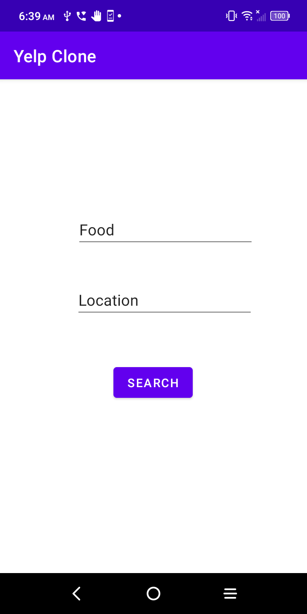
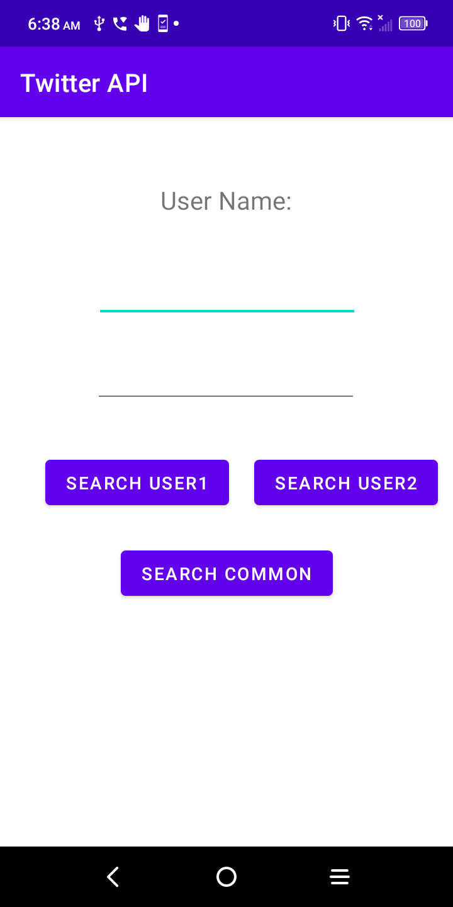
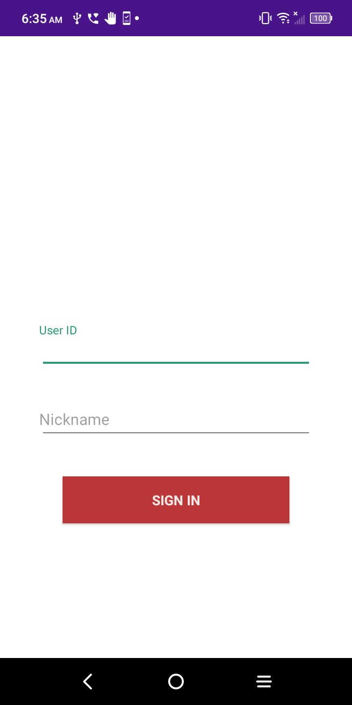

# cs501-mini-research
<h>This is Team Blue mini research deliverables
  
 We used three APIs: Yelp, twitter and Sendbird.
       
<b>Yelp</b>
    
     
    
 you enter types of food and then location, it will pop up the restaurants near you. Also there is a button to click and lead you to google map for exact address.
    
<pre>   
<b>Twitter</b>
      
 you enter first user name and it will search the accounts he/she/they follow. Same to second user. And you enter both, it will find the mutual account they follow. 
 
<b>SendBird</b>
        
 

    
